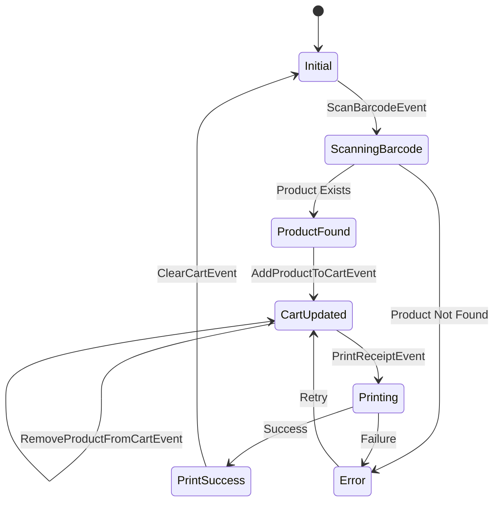

The billing feature is the core of the Flutter Billing App, handling barcode scanning, cart management, and receipt printing. It implements a clean architecture pattern with domain, data, and presentation layers.

## Architecture Overview

The billing feature follows Clean Architecture principles:

<CardGroup cols={3}>
  <Card title="Domain Layer" icon="circle-nodes">
    Business entities and logic
  </Card>
  <Card title="Data Layer" icon="database">
    Local storage via Hive
  </Card>
  <Card title="Presentation Layer" icon="desktop">
    BLoC state management + UI
  </Card>
</CardGroup>

## Domain Layer

### CartItem Entity

The `CartItem` entity represents a product in the shopping cart with quantity tracking.

**Location**: `lib/features/billing/domain/entities/cart_item.dart`

```dart
import 'package:equatable/equatable.dart';
import 'package:billing_app/features/product/domain/entities/product.dart';

class CartItem extends Equatable {
  final Product product;
  final int quantity;

  const CartItem({
    required this.product,
    this.quantity = 1,
  });

  double get total => product.price * quantity;

  CartItem copyWith({
    Product? product,
    int? quantity,
  }) {
    return CartItem(
      product: product ?? this.product,
      quantity: quantity ?? this.quantity,
    );
  }

  @override
  List<Object> get props => [product, quantity];
}
```

<Note>
  The `CartItem` entity extends `Equatable` for value equality, which is essential for BLoC state comparisons.
</Note>

## Presentation Layer

### BLoC Events

**Location**: `lib/features/billing/presentation/bloc/billing_event.dart`

The billing feature supports the following events:

<AccordionGroup>
  <Accordion title="ScanBarcodeEvent">
    Triggered when a barcode is scanned. Looks up the product and adds it to the cart.
    
    ```dart
    class ScanBarcodeEvent extends BillingEvent {
      final String barcode;
      const ScanBarcodeEvent(this.barcode);
    }
    ```
  </Accordion>

  <Accordion title="AddProductToCartEvent">
    Adds a product to the cart or increments quantity if already present.
    
    ```dart
    class AddProductToCartEvent extends BillingEvent {
      final Product product;
      const AddProductToCartEvent(this.product);
    }
    ```
  </Accordion>

  <Accordion title="RemoveProductFromCartEvent">
    Removes a product completely from the cart.
    
    ```dart
    class RemoveProductFromCartEvent extends BillingEvent {
      final String productId;
      const RemoveProductFromCartEvent(this.productId);
    }
    ```
  </Accordion>

  <Accordion title="UpdateQuantityEvent">
    Updates the quantity of a specific product in the cart.
    
    ```dart
    class UpdateQuantityEvent extends BillingEvent {
      final String productId;
      final int quantity;
      const UpdateQuantityEvent(this.productId, this.quantity);
    }
    ```
  </Accordion>

  <Accordion title="ClearCartEvent">
    Clears all items from the cart.
    
    ```dart
    class ClearCartEvent extends BillingEvent {}
    ```
  </Accordion>

  <Accordion title="PrintReceiptEvent">
    Prints a receipt with shop details and cart items.
    
    ```dart
    class PrintReceiptEvent extends BillingEvent {
      final String shopName;
      final String address1;
      final String address2;
      final String phone;
      final String footer;

      const PrintReceiptEvent({
        required this.shopName,
        required this.address1,
        required this.address2,
        required this.phone,
        required this.footer,
      });
    }
    ```
  </Accordion>
</AccordionGroup>

### BLoC State

**Location**: `lib/features/billing/presentation/bloc/billing_state.dart`

```dart
class BillingState extends Equatable {
  final List<CartItem> cartItems;
  final String? error;
  final bool isPrinting;
  final bool printSuccess;

  const BillingState({
    this.cartItems = const [],
    this.error,
    this.isPrinting = false,
    this.printSuccess = false,
  });

  double get totalAmount => cartItems.fold(0, (sum, item) => sum + item.total);

  BillingState copyWith({
    List<CartItem>? cartItems,
    String? error,
    bool clearError = false,
    bool? isPrinting,
    bool? printSuccess,
  }) {
    return BillingState(
      cartItems: cartItems ?? this.cartItems,
      error: clearError ? null : (error ?? this.error),
      isPrinting: isPrinting ?? this.isPrinting,
      printSuccess: printSuccess ?? this.printSuccess,
    );
  }

  @override
  List<Object?> get props => [cartItems, error, isPrinting, printSuccess];
}
```

<Info>
  The state includes a computed `totalAmount` getter that calculates the cart total by summing all item totals.
</Info>

### BillingBloc Implementation

**Location**: `lib/features/billing/presentation/bloc/billing_bloc.dart`

Key event handlers:

#### Barcode Scanning

```dart
Future<void> _onScanBarcode(
    ScanBarcodeEvent event, Emitter<BillingState> emit) async {
  final result = await getProductByBarcodeUseCase(event.barcode);
  result.fold(
    (failure) =>
        emit(state.copyWith(error: 'Product not found: ${event.barcode}')),
    (product) {
      add(AddProductToCartEvent(product));
    },
  );
}
```

#### Adding to Cart

```dart
void _onAddProductToCart(
    AddProductToCartEvent event, Emitter<BillingState> emit) {
  final cleanState = state.copyWith(error: null);

  final existingIndex = cleanState.cartItems
      .indexWhere((item) => item.product.id == event.product.id);
  if (existingIndex >= 0) {
    // Increment quantity if product already in cart
    final existingItem = cleanState.cartItems[existingIndex];
    final updatedItems = List<CartItem>.from(cleanState.cartItems);
    updatedItems[existingIndex] =
        existingItem.copyWith(quantity: existingItem.quantity + 1);
    emit(cleanState.copyWith(cartItems: updatedItems, error: null));
  } else {
    // Add new item to cart
    final newItem = CartItem(product: event.product);
    emit(cleanState.copyWith(
        cartItems: [...cleanState.cartItems, newItem], error: null));
  }
}
```

#### Receipt Printing

```dart
Future<void> _onPrintReceipt(
    PrintReceiptEvent event, Emitter<BillingState> emit) async {
  final printerHelper = PrinterHelper();

  // Auto-connect to saved printer if not connected
  if (!printerHelper.isConnected) {
    final savedMac = HiveDatabase.settingsBox.get('printer_mac');
    if (savedMac != null) {
      final connected = await printerHelper.connect(savedMac);
      if (!connected) {
        emit(state.copyWith(
            error: 'Failed to auto-connect to printer!', clearError: false));
        emit(state.copyWith(clearError: true));
        return;
      }
    } else {
      emit(state.copyWith(
          error: 'Printer not connected & no saved printer found!',
          clearError: false));
      emit(state.copyWith(clearError: true));
      return;
    }
  }

  emit(state.copyWith(
      isPrinting: true, printSuccess: false, clearError: true));

  try {
    final items = state.cartItems
        .map((item) => {
              'name': item.product.name,
              'qty': item.quantity,
              'price': item.product.price,
              'total': item.total,
            })
        .toList();

    await printerHelper.printReceipt(
        shopName: event.shopName,
        address1: event.address1,
        address2: event.address2,
        phone: event.phone,
        items: items,
        total: state.totalAmount,
        footer: event.footer);

    emit(state.copyWith(isPrinting: false, printSuccess: true));
  } catch (e) {
    emit(state.copyWith(
        isPrinting: false, error: 'Print failed: $e', clearError: false));
    emit(state.copyWith(clearError: true));
  }
}
```

<Warning>
  The printer must be paired and connected before printing. The app attempts auto-connection using saved MAC address.
</Warning>

## UI Pages

### HomePage

**Location**: `lib/features/billing/presentation/pages/home_page.dart:12`

The home page features:

- **Barcode scanner** with camera controls (top 40% of screen)
- **Cart list** with quantity controls (bottom panel)
- **Review Order button** (fixed at bottom)

Key features:
- 2-second cooldown per barcode to prevent duplicate scans
- Vibration feedback on successful scan
- Camera on/off toggle
- Flashlight toggle
- Real-time cart total calculation

### CheckoutPage

**Location**: `lib/features/billing/presentation/pages/checkout_page.dart:10`

The checkout page displays:

- **Order summary table** with product names, prices, and totals
- **UPI QR code** for payment (if shop has UPI ID configured)
- **Grand total** display
- **Print Receipt button** with loading state

<Tip>
  The QR code is generated using the UPI deep link format: `upi://pay?pa={upiId}&pn={shopName}&am={amount}&cu=INR`
</Tip>

## Integration Example

```dart
import 'package:flutter_bloc/flutter_bloc.dart';

// Initialize BillingBloc with dependencies
BlocProvider(
  create: (context) => BillingBloc(
    getProductByBarcodeUseCase: GetProductByBarcodeUseCase(
      repository: ProductRepositoryImpl(),
    ),
  ),
  child: HomePage(),
)
```

## State Flow Diagram



## Related Features

<CardGroup cols={2}>
  <Card title="Product Feature" icon="box" href="./product-feature">
    Manage products and inventory
  </Card>
  <Card title="Shop Feature" icon="store" href="./shop-feature">
    Configure shop details for receipts
  </Card>
  <Card title="Settings Feature" icon="gear" href="./settings-feature">
    Connect and configure Bluetooth printer
  </Card>
</CardGroup>