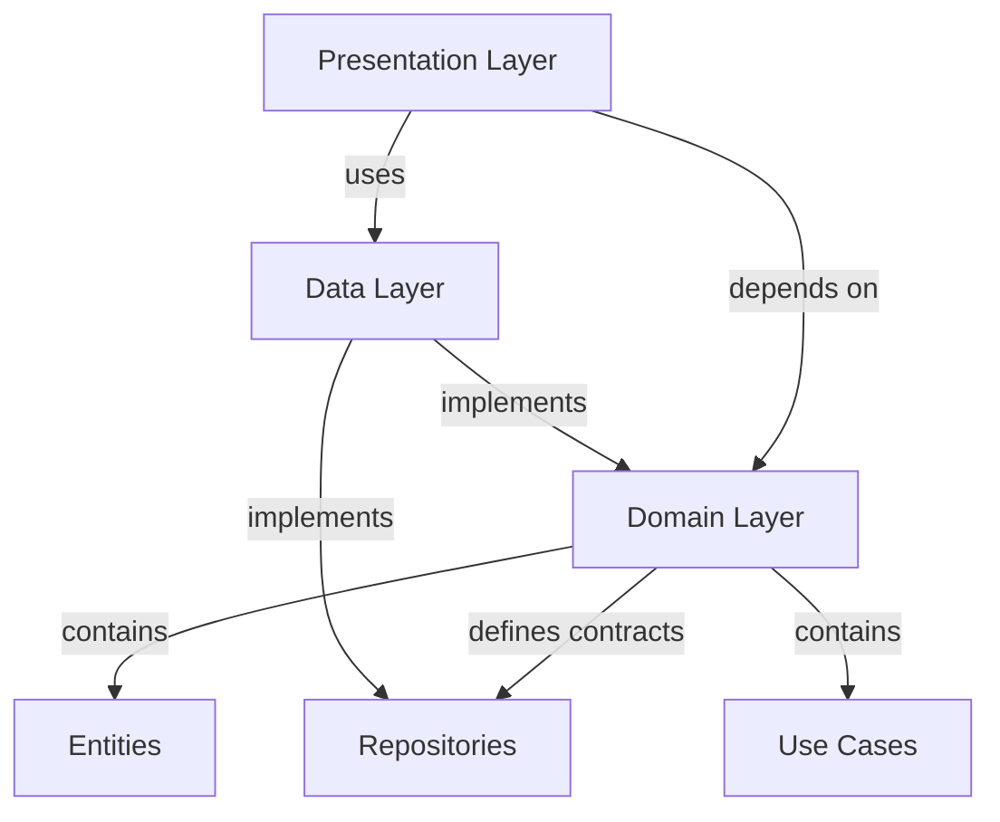

## Overview

The Flutter Billing App follows **Clean Architecture** principles combined with **Feature-First Design**. This architectural approach ensures separation of concerns, testability, and maintainability by organizing code into distinct layers with clear dependencies.

<Info>
Clean Architecture was popularized by Robert C. Martin (Uncle Bob) and enforces the Dependency Rule: source code dependencies must point inward, with inner layers knowing nothing about outer layers.
</Info>

## Architecture Layers

The application is structured into three primary layers:

### 1. Domain Layer (Business Logic)

The **innermost layer** containing the core business logic, completely independent of external frameworks and libraries.

<CardGroup cols={2}>
  <Card title="Entities" icon="cube">
    Pure Dart classes representing business objects with no external dependencies
  </Card>
  <Card title="Repositories (Interfaces)" icon="diagram-project">
    Abstract contracts defining data operations without implementation details
  </Card>
  <Card title="Use Cases" icon="gears">
    Single-responsibility classes encapsulating specific business operations
  </Card>
</CardGroup>

#### Example: Product Entity

Entities are immutable value objects using `Equatable` for value equality:

```dart lib/features/product/domain/entities/product.dart
import 'package:equatable/equatable.dart';

class Product extends Equatable {
  final String id;
  final String name;
  final String barcode;
  final double price;
  final int stock;

  const Product({
    required this.id,
    required this.name,
    required this.barcode,
    required this.price,
    this.stock = 0,
  });

  @override
  List<Object?> get props => [id, name, barcode, price, stock];
}
```

#### Repository Interface

Repositories in the domain layer define **what** operations are available, not **how** they're implemented:

```dart lib/features/product/domain/repositories/product_repository.dart
import 'package:fpdart/fpdart.dart';
import '../../../../core/error/failure.dart';
import '../entities/product.dart';

abstract class ProductRepository {
  Future<Either<Failure, List<Product>>> getProducts();
  Future<Either<Failure, Product>> getProductByBarcode(String barcode);
  Future<Either<Failure, void>> addProduct(Product product);
  Future<Either<Failure, void>> updateProduct(Product product);
  Future<Either<Failure, void>> deleteProduct(String id);
}
```

<Note>
Notice the use of `Either<Failure, T>` from `fpdart` - this enforces functional error handling instead of throwing exceptions.
</Note>

#### Use Cases

Each use case represents a single business operation following the **Single Responsibility Principle**:

```dart lib/features/product/domain/usecases/product_usecases.dart
import 'package:fpdart/fpdart.dart';
import '../../../../core/error/failure.dart';
import '../../../../core/usecase/usecase.dart';
import '../entities/product.dart';
import '../repositories/product_repository.dart';

class GetProductsUseCase implements UseCase<List<Product>, NoParams> {
  final ProductRepository repository;

  GetProductsUseCase(this.repository);

  @override
  Future<Either<Failure, List<Product>>> call(NoParams params) {
    return repository.getProducts();
  }
}

class AddProductUseCase implements UseCase<void, Product> {
  final ProductRepository repository;

  AddProductUseCase(this.repository);

  @override
  Future<Either<Failure, void>> call(Product params) {
    return repository.addProduct(params);
  }
}
```

### 2. Data Layer (Data Management)

The **data layer** implements the repository interfaces defined in the domain layer, handling data sources and caching.

<Steps>
  <Step title="Models">
    Data transfer objects that extend domain entities with serialization capabilities (JSON, Hive)
  </Step>
  <Step title="Repository Implementations">
    Concrete implementations of domain repository interfaces
  </Step>
  <Step title="Data Sources">
    Abstractions for local (Hive) and remote data sources
  </Step>
</Steps>

#### Repository Implementation

The implementation uses Hive for local storage and returns `Either` for error handling:

```dart lib/features/product/data/repositories/product_repository_impl.dart
import 'package:fpdart/fpdart.dart';
import '../../../../core/data/hive_database.dart';
import '../../../../core/error/failure.dart';
import '../../domain/entities/product.dart';
import '../../domain/repositories/product_repository.dart';
import '../models/product_model.dart';

class ProductRepositoryImpl implements ProductRepository {
  @override
  Future<Either<Failure, List<Product>>> getProducts() async {
    try {
      final box = HiveDatabase.productBox;
      final products = box.values.toList();
      return Right(products);
    } catch (e) {
      return Left(CacheFailure(e.toString()));
    }
  }

  @override
  Future<Either<Failure, void>> addProduct(Product product) async {
    try {
      final box = HiveDatabase.productBox;
      final model = ProductModel.fromEntity(product);
      await box.put(model.id, model);
      return const Right(null);
    } catch (e) {
      return Left(CacheFailure(e.toString()));
    }
  }

  // Additional methods...
}
```

### 3. Presentation Layer (UI & State)

The **outermost layer** containing UI widgets, state management (BLoC), and user interaction logic.

<CardGroup cols={3}>
  <Card title="Pages" icon="window">
    Flutter widgets representing full screens
  </Card>
  <Card title="BLoC" icon="arrows-spin">
    Business Logic Components managing state
  </Card>
  <Card title="Widgets" icon="puzzle-piece">
    Reusable UI components
  </Card>
</CardGroup>

See the [State Management](/development/state-management) page for detailed BLoC implementation patterns.

## Error Handling Strategy

The app uses **functional error handling** with `fpdart` instead of traditional exceptions:

```dart lib/core/error/failure.dart
import 'package:equatable/equatable.dart';

abstract class Failure extends Equatable {
  final String message;
  const Failure(this.message);

  @override
  List<Object> get props => [message];
}

class CacheFailure extends Failure {
  const CacheFailure(String message) : super(message);
}
```

<Accordion title="Why Either<Failure, T> instead of exceptions?">
**Benefits of the Either pattern:**

1. **Explicit error handling** - Compiler forces you to handle both success and failure cases
2. **Type safety** - Errors are part of the type signature
3. **No try-catch blocks** - Cleaner, more functional code
4. **Better testability** - Errors are predictable and easily mockable

**Usage pattern:**
```dart
final result = await useCase(params);
result.fold(
  (failure) => emit(ErrorState(failure.message)),
  (data) => emit(SuccessState(data)),
);
```
</Accordion>

## UseCase Base Contract

All use cases implement a common interface:

```dart lib/core/usecase/usecase.dart
import 'package:fpdart/fpdart.dart';
import '../error/failure.dart';

abstract class UseCase<Result, Params> {
  Future<Either<Failure, Result>> call(Params params);
}

class NoParams {}
```

## Dependency Flow



<Warning>
**Critical Rule:** The domain layer must NEVER depend on presentation or data layers. Dependencies always point inward.
</Warning>

## Benefits of This Architecture

<AccordionGroup>
  <Accordion title="Testability">
    Each layer can be tested independently with mocked dependencies. Business logic tests don't require Flutter framework.
  </Accordion>
  
  <Accordion title="Maintainability">
    Clear separation means changes in one layer rarely affect others. Database migrations don't touch business logic.
  </Accordion>
  
  <Accordion title="Scalability">
    New features follow the same pattern. Team members can work on different layers without conflicts.
  </Accordion>
  
  <Accordion title="Framework Independence">
    Business logic is pure Dart. Migrating from Hive to SQLite only affects the data layer.
  </Accordion>
</AccordionGroup>

## Next Steps

<CardGroup cols={2}>
  <Card title="Project Structure" icon="folder-tree" href="/development/project-structure">
    Explore the complete file and folder organization
  </Card>
  <Card title="State Management" icon="arrows-spin" href="/development/state-management">
    Learn the BLoC pattern implementation
  </Card>
  <Card title="Dependency Injection" icon="plug" href="/development/dependency-injection">
    Understand the service locator setup with get_it
  </Card>
</CardGroup>