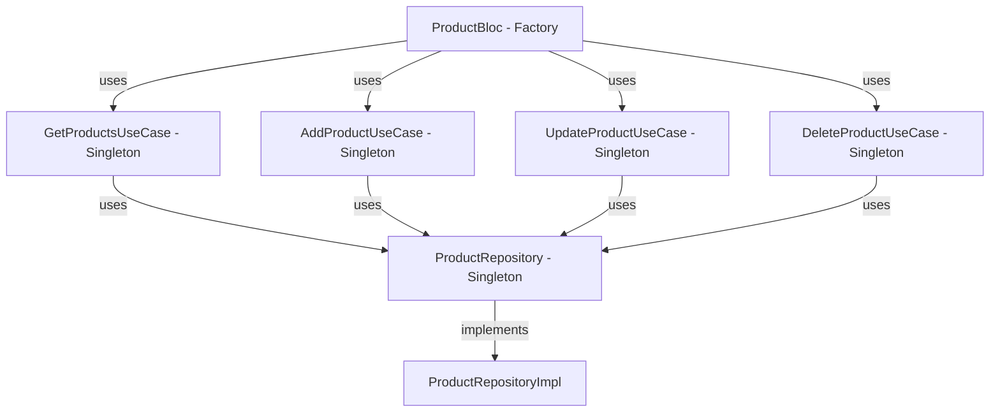

## Overview

The Flutter Billing App uses the **Service Locator pattern** with the `get_it` package for dependency injection (DI). This approach provides loose coupling, improved testability, and centralized dependency management.

<Info>
**get_it** is a lightweight service locator that acts as a global registry for dependencies. It's simple, performant, and doesn't require code generation.
</Info>

## Why Dependency Injection?

Dependency Injection solves several critical problems:

<CardGroup cols={2}>
  <Card title="Loose Coupling" icon="link-slash">
    Components depend on abstractions (interfaces) rather than concrete implementations
  </Card>
  <Card title="Testability" icon="flask">
    Easy to swap real implementations with mocks for testing
  </Card>
  <Card title="Maintainability" icon="wrench">
    Changes to dependencies don't ripple through the codebase
  </Card>
  <Card title="Single Source of Truth" icon="database">
    All dependencies are configured in one place
  </Card>
</CardGroup>

## Service Locator Setup

The entire dependency injection configuration is in `core/service_locator.dart`:

```dart lib/core/service_locator.dart
import 'package:get_it/get_it.dart';
import '../../features/product/data/repositories/product_repository_impl.dart';
import '../../features/product/domain/repositories/product_repository.dart';
import '../../features/product/domain/usecases/product_usecases.dart';
import '../../features/product/presentation/bloc/product_bloc.dart';
import '../../features/shop/data/repositories/shop_repository_impl.dart';
import '../../features/shop/domain/repositories/shop_repository.dart';
import '../../features/shop/domain/usecases/shop_usecases.dart';
import '../../features/shop/presentation/bloc/shop_bloc.dart';
import '../../features/settings/data/repositories/printer_repository_impl.dart';
import '../../features/settings/domain/repositories/printer_repository.dart';
import '../../features/settings/presentation/bloc/printer_bloc.dart';

// Global service locator instance
final sl = GetIt.instance;

Future<void> init() async {
  // Features - Product
  // Bloc
  sl.registerFactory(
    () => ProductBloc(
      getProductsUseCase: sl(),
      addProductUseCase: sl(),
      updateProductUseCase: sl(),
      deleteProductUseCase: sl(),
    ),
  );

  sl.registerFactory(
    () => ShopBloc(
      getShopUseCase: sl(),
      updateShopUseCase: sl(),
    ),
  );

  sl.registerFactory(
    () => PrinterBloc(
      repository: sl(),
    ),
  );

  // Use cases
  sl.registerLazySingleton(() => GetProductsUseCase(sl()));
  sl.registerLazySingleton(() => AddProductUseCase(sl()));
  sl.registerLazySingleton(() => UpdateProductUseCase(sl()));
  sl.registerLazySingleton(() => DeleteProductUseCase(sl()));
  sl.registerLazySingleton(() => GetProductByBarcodeUseCase(sl()));

  // Repository
  sl.registerLazySingleton<ProductRepository>(
    () => ProductRepositoryImpl(),
  );

  // Features - Shop
  // Use cases
  sl.registerLazySingleton(() => GetShopUseCase(sl()));
  sl.registerLazySingleton(() => UpdateShopUseCase(sl()));

  // Repository
  sl.registerLazySingleton<ShopRepository>(
    () => ShopRepositoryImpl(),
  );

  // Features - Settings / Printer
  sl.registerLazySingleton<PrinterRepository>(
    () => PrinterRepositoryImpl(),
  );
}
```

## Registration Types

get_it provides several registration methods with different lifecycles:

<Tabs>
  <Tab title="Factory">
    ### registerFactory()
    
    Creates a **new instance** every time it's requested.
    
    ```dart
    sl.registerFactory(() => ProductBloc(
      getProductsUseCase: sl(),
      addProductUseCase: sl(),
    ));
    ```
    
    **Use for:**
    - BLoCs (each widget tree should have its own instance)
    - Stateful objects that shouldn't be shared
    
    **Example:**
    ```dart
    // Each call creates a new instance
    final bloc1 = sl<ProductBloc>(); // New instance
    final bloc2 = sl<ProductBloc>(); // Different instance
    ```
  </Tab>
  
  <Tab title="Lazy Singleton">
    ### registerLazySingleton()
    
    Creates a **single instance** on first access, then reuses it.
    
    ```dart
    sl.registerLazySingleton(() => GetProductsUseCase(sl()));
    sl.registerLazySingleton<ProductRepository>(
      () => ProductRepositoryImpl(),
    );
    ```
    
    **Use for:**
    - Use cases (stateless, reusable operations)
    - Repositories (data access layer)
    - Services and utilities
    
    **Example:**
    ```dart
    // First call creates instance
    final useCase1 = sl<GetProductsUseCase>(); // Creates instance
    // Subsequent calls return same instance
    final useCase2 = sl<GetProductsUseCase>(); // Same instance
    ```
  </Tab>
  
  <Tab title="Singleton">
    ### registerSingleton()
    
    Registers an **already created** instance immediately.
    
    ```dart
    sl.registerSingleton<Database>(Database.instance);
    ```
    
    **Use for:**
    - Pre-initialized objects
    - Objects that require async initialization
    
    **Example:**
    ```dart
    final database = await Database.init();
    sl.registerSingleton<Database>(database);
    ```
  </Tab>
</Tabs>

<Accordion title="Factory vs Lazy Singleton - When to use which?">
**Use `registerFactory` when:**
- Each consumer needs its own independent instance
- The object has state that shouldn't be shared
- Example: BLoCs, ViewModels

**Use `registerLazySingleton` when:**
- The object is stateless or state is shared
- Creating multiple instances wastes resources
- Example: Repositories, Use Cases, Services

**Rule of thumb:** BLoCs are factories, everything else is typically lazy singletons.
</Accordion>

## Dependency Resolution

get_it automatically resolves dependencies using `sl()` calls:

```dart
// Register repository first
sl.registerLazySingleton<ProductRepository>(
  () => ProductRepositoryImpl(),
);

// Use case automatically gets injected repository
sl.registerLazySingleton(() => GetProductsUseCase(sl()));
//                                                   ^^^ Resolves to ProductRepository

// BLoC gets all use cases injected
sl.registerFactory(
  () => ProductBloc(
    getProductsUseCase: sl(),      // GetProductsUseCase
    addProductUseCase: sl(),        // AddProductUseCase
    updateProductUseCase: sl(),     // UpdateProductUseCase
    deleteProductUseCase: sl(),     // DeleteProductUseCase
  ),
);
```

<Note>
The `sl()` call without type parameter uses Dart's type inference to determine what to retrieve:

```dart
GetProductsUseCase useCase = sl(); // Inferred
final useCase = sl<GetProductsUseCase>(); // Explicit
```
</Note>

## Dependency Graph

Here's how dependencies flow through the Product feature:



## Initialization

The service locator is initialized during app startup:

```dart lib/main.dart
import 'core/service_locator.dart' as di;

void main() async {
  WidgetsFlutterBinding.ensureInitialized();
  await HiveDatabase.init();  // Initialize database first
  await di.init();             // Then setup dependencies
  runApp(const MyApp());
}
```

<Steps>
  <Step title="Ensure Flutter is initialized">
    `WidgetsFlutterBinding.ensureInitialized()` prepares Flutter for async operations
  </Step>
  <Step title="Initialize Hive database">
    Open Hive boxes before registering repositories that use them
  </Step>
  <Step title="Setup dependency injection">
    Register all dependencies in the service locator
  </Step>
  <Step title="Run the app">
    Start the Flutter app with dependencies ready
  </Step>
</Steps>

## Using Dependencies

### In BlocProvider

Retrieve BLoCs from the service locator when providing them:

```dart
MultiBlocProvider(
  providers: [
    BlocProvider<ProductBloc>(
      create: (context) => di.sl<ProductBloc>()..add(LoadProducts()),
    ),
    BlocProvider<ShopBloc>(
      create: (context) => di.sl<ShopBloc>()..add(LoadShopEvent()),
    ),
  ],
  child: MaterialApp.router(...),
)
```

<Note>
The `..add(LoadProducts())` is cascade notation to immediately dispatch an initial event after creating the BLoC.
</Note>

### In Tests

Easily swap real implementations with mocks:

```dart
import 'package:mockito/mockito.dart';
import 'package:get_it/get_it.dart';

void main() {
  late GetIt sl;
  late MockProductRepository mockRepository;

  setUp(() {
    sl = GetIt.instance;
    mockRepository = MockProductRepository();
    
    // Register mock instead of real implementation
    sl.registerLazySingleton<ProductRepository>(() => mockRepository);
    sl.registerLazySingleton(() => GetProductsUseCase(sl()));
    sl.registerFactory(() => ProductBloc(
      getProductsUseCase: sl(),
      // ...
    ));
  });

  tearDown(() {
    sl.reset(); // Clear all registrations
  });

  test('should load products successfully', () async {
    // Mock returns test data
    when(mockRepository.getProducts())
        .thenAnswer((_) async => Right([testProduct]));

    final bloc = sl<ProductBloc>();
    bloc.add(LoadProducts());

    await expectLater(
      bloc.stream,
      emitsInOrder([
        ProductState(status: ProductStatus.loading),
        ProductState(status: ProductStatus.loaded, products: [testProduct]),
      ]),
    );
  });
}
```

## Registration Order Matters

<Warning>
Register dependencies **before** dependents. Register repositories before use cases, use cases before BLoCs.
</Warning>

```dart
// Correct order
sl.registerLazySingleton<ProductRepository>(() => ProductRepositoryImpl());
sl.registerLazySingleton(() => GetProductsUseCase(sl())); // Can resolve ProductRepository
sl.registerFactory(() => ProductBloc(getProductsUseCase: sl())); // Can resolve GetProductsUseCase

// Wrong order - will crash!
sl.registerFactory(() => ProductBloc(getProductsUseCase: sl())); // sl() fails - use case not registered yet
sl.registerLazySingleton(() => GetProductsUseCase(sl()));
sl.registerLazySingleton<ProductRepository>(() => ProductRepositoryImpl());
```

## Interface Registration

Register concrete implementations as interfaces for flexibility:

```dart
// Good: Register as interface
sl.registerLazySingleton<ProductRepository>(
  () => ProductRepositoryImpl(),
);

// Retrieve as interface
final repo = sl<ProductRepository>(); // Returns ProductRepositoryImpl

// Bad: Register as concrete type
sl.registerLazySingleton<ProductRepositoryImpl>(
  () => ProductRepositoryImpl(),
);
```

<Accordion title="Why register as interface?">
Registering as the interface (abstract class) allows you to swap implementations without changing any code that depends on it:

```dart
// Switch to a different implementation
sl.registerLazySingleton<ProductRepository>(
  () => MockProductRepository(), // Different implementation
);

// All code using ProductRepository continues to work
final useCase = GetProductsUseCase(sl()); // Gets mock automatically
```

This is especially useful for:
- Testing (swap real implementations with mocks)
- Feature flags (enable different implementations)
- A/B testing (test different data sources)
</Accordion>

## Feature Organization

Organize registrations by feature for clarity:

```dart
Future<void> init() async {
  // ===== PRODUCT FEATURE =====
  // BLoC
  sl.registerFactory(() => ProductBloc(...));
  
  // Use Cases
  sl.registerLazySingleton(() => GetProductsUseCase(sl()));
  sl.registerLazySingleton(() => AddProductUseCase(sl()));
  
  // Repository
  sl.registerLazySingleton<ProductRepository>(() => ProductRepositoryImpl());

  // ===== SHOP FEATURE =====
  // BLoC
  sl.registerFactory(() => ShopBloc(...));
  
  // Use Cases
  sl.registerLazySingleton(() => GetShopUseCase(sl()));
  
  // Repository
  sl.registerLazySingleton<ShopRepository>(() => ShopRepositoryImpl());

  // ===== SETTINGS FEATURE =====
  sl.registerLazySingleton<PrinterRepository>(() => PrinterRepositoryImpl());
}
```

## Best Practices

<AccordionGroup>
  <Accordion title="Use const for import alias">
    Import the service locator with an alias to avoid naming conflicts:
    
    ```dart
    import 'core/service_locator.dart' as di;
    
    // Use as di.sl<Type>()
    final bloc = di.sl<ProductBloc>();
    ```
  </Accordion>
  
  <Accordion title="Register in correct lifecycle">
    - **Factories** for BLoCs and stateful objects
    - **Lazy Singletons** for use cases, repositories, and services
    - **Singletons** for pre-initialized objects
  </Accordion>
  
  <Accordion title="Keep registration in one file">
    All DI registration should be in `core/service_locator.dart`. Don't scatter registrations across multiple files.
  </Accordion>
  
  <Accordion title="Reset in tests">
    Always call `sl.reset()` in `tearDown()` to clear registrations between tests:
    
    ```dart
    tearDown(() {
      GetIt.instance.reset();
    });
    ```
  </Accordion>
  
  <Accordion title="Avoid circular dependencies">
    If A depends on B and B depends on A, refactor to break the cycle:
    
    ```dart
    // Bad: Circular dependency
    sl.registerLazySingleton(() => ServiceA(sl<ServiceB>()));
    sl.registerLazySingleton(() => ServiceB(sl<ServiceA>()));
    
    // Good: Extract shared logic
    sl.registerLazySingleton(() => SharedService());
    sl.registerLazySingleton(() => ServiceA(sl<SharedService>()));
    sl.registerLazySingleton(() => ServiceB(sl<SharedService>()));
    ```
  </Accordion>
</AccordionGroup>

## Alternative DI Approaches

<Tabs>
  <Tab title="get_it (Current)">
    **Pros:**
    - Simple, no code generation
    - Fast and lightweight
    - Works with any Dart/Flutter app
    - No build_runner required
    
    **Cons:**
    - No compile-time safety
    - Manual registration
    - Global state (service locator pattern)
  </Tab>
  
  <Tab title="Injectable">
    **Pros:**
    - Code generation for registration
    - Compile-time safety
    - Less boilerplate
    - Built on top of get_it
    
    **Cons:**
    - Requires build_runner
    - Annotations clutter code
    - More complex setup
  </Tab>
  
  <Tab title="Riverpod">
    **Pros:**
    - Compile-time safety
    - No global state
    - Excellent for state management + DI
    - Provider pattern
    
    **Cons:**
    - Steeper learning curve
    - Different paradigm from BLoC
    - More boilerplate for complex dependencies
  </Tab>
</Tabs>

<Info>
This app uses **get_it** for its simplicity and explicit control over dependency registration, which pairs well with Clean Architecture.
</Info>

## Debugging Dependencies

get_it provides helpful error messages:

```dart
// Missing dependency
final bloc = sl<ProductBloc>();
// Error: Object/factory with type ProductBloc is not registered inside GetIt.

// Check if registered
if (sl.isRegistered<ProductBloc>()) {
  final bloc = sl<ProductBloc>();
}

// Unregister for cleanup
sl.unregister<ProductBloc>();
```

## Next Steps

<CardGroup cols={2}>
  <Card title="Clean Architecture" icon="layer-group" href="/development/clean-architecture">
    Understand how DI supports the layered architecture
  </Card>
  <Card title="State Management" icon="arrows-spin" href="/development/state-management">
    See how BLoCs are retrieved from the service locator
  </Card>
  <Card title="Project Structure" icon="folder-tree" href="/development/project-structure">
    Locate the service_locator.dart file in the codebase
  </Card>
</CardGroup>