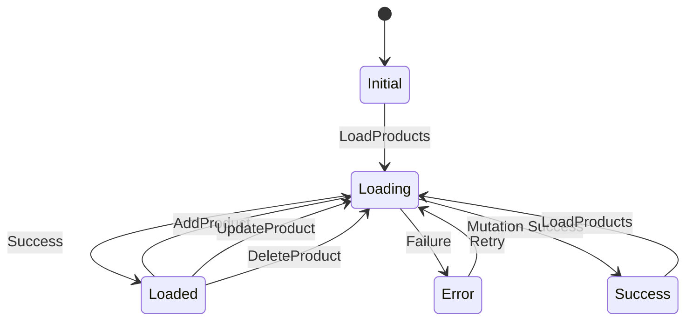

The product feature handles CRUD operations for products, including barcode management, pricing, and stock tracking. It uses Hive for local storage and follows Clean Architecture principles.

## Architecture Overview

<Steps>
  <Step title="Domain Layer">
    Defines the Product entity and repository contracts
  </Step>
  <Step title="Data Layer">
    Implements Hive-based local storage with ProductModel
  </Step>
  <Step title="Presentation Layer">
    BLoC pattern for state management and UI components
  </Step>
</Steps>

## Domain Layer

### Product Entity

**Location**: `lib/features/product/domain/entities/product.dart`

```dart
import 'package:equatable/equatable.dart';

class Product extends Equatable {
  final String id;
  final String name;
  final String barcode;
  final double price;
  final int stock;

  const Product({
    required this.id,
    required this.name,
    required this.barcode,
    required this.price,
    this.stock = 0,
  });

  @override
  List<Object?> get props => [id, name, barcode, price, stock];
}
```

<Info>
  The product ID is kept separate from the barcode for flexibility, though in many cases the barcode serves as the ID.
</Info>

### Repository Interface

**Location**: `lib/features/product/domain/repositories/product_repository.dart`

```dart
import 'package:fpdart/fpdart.dart';
import '../../../../core/error/failure.dart';
import '../../domain/entities/product.dart';

abstract class ProductRepository {
  Future<Either<Failure, List<Product>>> getProducts();
  Future<Either<Failure, Product>> getProductByBarcode(String barcode);
  Future<Either<Failure, void>> addProduct(Product product);
  Future<Either<Failure, void>> updateProduct(Product product);
  Future<Either<Failure, void>> deleteProduct(String id);
}
```

<Note>
  The repository uses `Either` from fpdart for functional error handling. `Left` represents failure, `Right` represents success.
</Note>

## Data Layer

### ProductModel

**Location**: `lib/features/product/data/models/product_model.dart`

The ProductModel extends Product and adds Hive annotations for persistence:

```dart
import 'package:hive/hive.dart';
import '../../domain/entities/product.dart';

part 'product_model.g.dart';

@HiveType(typeId: 0)
class ProductModel extends Product {
  @override
  @HiveField(0)
  final String id;
  
  @override
  @HiveField(1)
  final String name;
  
  @override
  @HiveField(2)
  final String barcode;
  
  @override
  @HiveField(3)
  final double price;
  
  @override
  @HiveField(4)
  final int stock;

  const ProductModel({
    required this.id,
    required this.name,
    required this.barcode,
    required this.price,
    required this.stock,
  }) : super(
          id: id,
          name: name,
          barcode: barcode,
          price: price,
          stock: stock,
        );

  factory ProductModel.fromEntity(Product product) {
    return ProductModel(
      id: product.id,
      name: product.name,
      barcode: product.barcode,
      price: product.price,
      stock: product.stock,
    );
  }

  Product toEntity() {
    return Product(
      id: id,
      name: name,
      barcode: barcode,
      price: price,
      stock: stock,
    );
  }
}
```

<Warning>
  The typeId must be unique across all Hive models in your app. ProductModel uses typeId 0.
</Warning>

### Repository Implementation

**Location**: `lib/features/product/data/repositories/product_repository_impl.dart`

```dart
import 'package:fpdart/fpdart.dart';
import '../../../../core/data/hive_database.dart';
import '../../../../core/error/failure.dart';
import '../../domain/entities/product.dart';
import '../../domain/repositories/product_repository.dart';
import '../models/product_model.dart';

class ProductRepositoryImpl implements ProductRepository {
  @override
  Future<Either<Failure, List<Product>>> getProducts() async {
    try {
      final box = HiveDatabase.productBox;
      final products = box.values.toList();
      return Right(products);
    } catch (e) {
      return Left(CacheFailure(e.toString()));
    }
  }

  @override
  Future<Either<Failure, Product>> getProductByBarcode(String barcode) async {
    try {
      final box = HiveDatabase.productBox;
      final product = box.values.firstWhere(
        (element) => element.barcode == barcode,
        orElse: () => throw Exception('Product not found'),
      );
      return Right(product);
    } catch (e) {
      return Left(CacheFailure(e.toString()));
    }
  }

  @override
  Future<Either<Failure, void>> addProduct(Product product) async {
    try {
      final box = HiveDatabase.productBox;
      final model = ProductModel.fromEntity(product);
      await box.put(model.id, model); // Using ID as key
      return const Right(null);
    } catch (e) {
      return Left(CacheFailure(e.toString()));
    }
  }

  @override
  Future<Either<Failure, void>> updateProduct(Product product) async {
    try {
      final box = HiveDatabase.productBox;
      final model = ProductModel.fromEntity(product);
      await box.put(model.id, model);
      return const Right(null);
    } catch (e) {
      return Left(CacheFailure(e.toString()));
    }
  }

  @override
  Future<Either<Failure, void>> deleteProduct(String id) async {
    try {
      final box = HiveDatabase.productBox;
      await box.delete(id);
      return const Right(null);
    } catch (e) {
      return Left(CacheFailure(e.toString()));
    }
  }
}
```

## Presentation Layer

### ProductState

**Location**: `lib/features/product/presentation/bloc/product_state.dart`

```dart
enum ProductStatus { initial, loading, loaded, error, success }

class ProductState extends Equatable {
  final ProductStatus status;
  final List<Product> products;
  final String? message;

  const ProductState({
    this.status = ProductStatus.initial,
    this.products = const [],
    this.message,
  });

  ProductState copyWith({
    ProductStatus? status,
    List<Product>? products,
    String? message,
  }) {
    return ProductState(
      status: status ?? this.status,
      products: products ?? this.products,
      message: message,
    );
  }

  @override
  List<Object?> get props => [status, products, message];
}
```

### ProductEvent

**Location**: `lib/features/product/presentation/bloc/product_event.dart`

<Tabs>
  <Tab title="LoadProducts">
    Loads all products from the repository.
    
    ```dart
    class LoadProducts extends ProductEvent {}
    ```
  </Tab>
  
  <Tab title="AddProduct">
    Adds a new product to the inventory.
    
    ```dart
    class AddProduct extends ProductEvent {
      final Product product;
      const AddProduct(this.product);
    }
    ```
  </Tab>
  
  <Tab title="UpdateProduct">
    Updates an existing product.
    
    ```dart
    class UpdateProduct extends ProductEvent {
      final Product product;
      const UpdateProduct(this.product);
    }
    ```
  </Tab>
  
  <Tab title="DeleteProduct">
    Deletes a product by ID.
    
    ```dart
    class DeleteProduct extends ProductEvent {
      final String id;
      const DeleteProduct(this.id);
    }
    ```
  </Tab>
</Tabs>

### ProductBloc Implementation

**Location**: `lib/features/product/presentation/bloc/product_bloc.dart`

Key event handlers:

#### Load Products

```dart
Future<void> _onLoadProducts(
    LoadProducts event, Emitter<ProductState> emit) async {
  emit(state.copyWith(status: ProductStatus.loading));
  final result = await getProductsUseCase(NoParams());
  result.fold(
    (failure) => emit(state.copyWith(
        status: ProductStatus.error, message: failure.message)),
    (products) => emit(
        state.copyWith(status: ProductStatus.loaded, products: products)),
  );
}
```

#### Add Product

```dart
Future<void> _onAddProduct(
    AddProduct event, Emitter<ProductState> emit) async {
  emit(state.copyWith(status: ProductStatus.loading));
  final result = await addProductUseCase(event.product);
  result.fold(
    (failure) => emit(state.copyWith(
        status: ProductStatus.error, message: failure.message)),
    (_) {
      emit(state.copyWith(
          status: ProductStatus.success,
          message: 'Product added successfully'));
      add(LoadProducts()); // Reload products list
    },
  );
}
```

#### Update Product

```dart
Future<void> _onUpdateProduct(
    UpdateProduct event, Emitter<ProductState> emit) async {
  emit(state.copyWith(status: ProductStatus.loading));
  final result = await updateProductUseCase(event.product);
  result.fold(
    (failure) => emit(state.copyWith(
        status: ProductStatus.error, message: failure.message)),
    (_) {
      emit(state.copyWith(
          status: ProductStatus.success,
          message: 'Product updated successfully'));
      add(LoadProducts());
    },
  );
}
```

#### Delete Product

```dart
Future<void> _onDeleteProduct(
    DeleteProduct event, Emitter<ProductState> emit) async {
  emit(state.copyWith(status: ProductStatus.loading));
  final result = await deleteProductUseCase(event.id);
  result.fold(
    (failure) => emit(state.copyWith(
        status: ProductStatus.error, message: failure.message)),
    (_) {
      emit(state.copyWith(
          status: ProductStatus.success,
          message: 'Product deleted successfully'));
      add(LoadProducts());
    },
  );
}
```

<Tip>
  After any mutation (add/update/delete), the BLoC automatically reloads the products list to keep the UI in sync.
</Tip>

## Usage Examples

### Adding a Product

```dart
context.read<ProductBloc>().add(
  AddProduct(
    Product(
      id: uuid.v4(),
      name: 'Coca Cola 500ml',
      barcode: '8901234567890',
      price: 40.0,
      stock: 100,
    ),
  ),
);
```

### Updating a Product

```dart
context.read<ProductBloc>().add(
  UpdateProduct(
    existingProduct.copyWith(price: 45.0),
  ),
);
```

### Loading Products

```dart
// Trigger load
context.read<ProductBloc>().add(LoadProducts());

// Listen to state
BlocBuilder<ProductBloc, ProductState>(
  builder: (context, state) {
    if (state.status == ProductStatus.loading) {
      return CircularProgressIndicator();
    }
    if (state.status == ProductStatus.loaded) {
      return ListView.builder(
        itemCount: state.products.length,
        itemBuilder: (context, index) {
          final product = state.products[index];
          return ListTile(
            title: Text(product.name),
            subtitle: Text('₹${product.price}'),
            trailing: Text('Stock: ${product.stock}'),
          );
        },
      );
    }
    return SizedBox.shrink();
  },
)
```

## State Transitions



## Data Flow

<Steps>
  <Step title="Event Dispatch">
    UI dispatches an event (e.g., `AddProduct`)
  </Step>
  <Step title="Use Case Execution">
    BLoC calls the appropriate use case
  </Step>
  <Step title="Repository Call">
    Use case invokes repository method
  </Step>
  <Step title="Hive Operation">
    Repository performs Hive database operation
  </Step>
  <Step title="Result Handling">
    Either success or failure is returned
  </Step>
  <Step title="State Emission">
    BLoC emits new state to UI
  </Step>
  <Step title="UI Update">
    BlocBuilder rebuilds with new state
  </Step>
</Steps>

## Related Features

<CardGroup cols={2}>
  <Card title="Billing Feature" icon="shopping-cart" href="./billing-feature">
    Uses products for cart and checkout
  </Card>
  <Card title="Shop Feature" icon="store" href="./shop-feature">
    Shop settings for product display
  </Card>
</CardGroup>