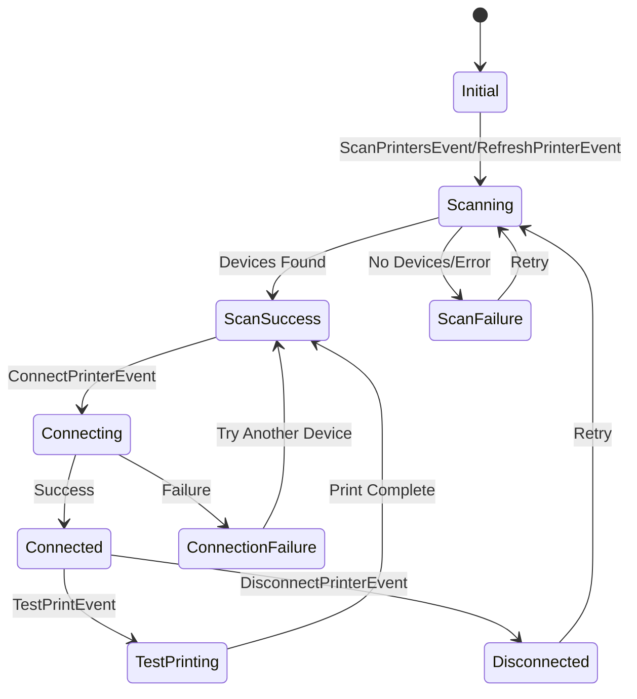

The settings feature manages Bluetooth thermal printer connectivity, including scanning for devices, pairing, connection management, and test printing. It uses the `print_bluetooth_thermal` package for Bluetooth operations.

## Architecture Overview

The settings feature focuses primarily on printer management:

<CardGroup cols={3}>
  <Card title="Domain Layer" icon="circle-nodes">
    Printer repository contract
  </Card>
  <Card title="Data Layer" icon="database">
    Bluetooth operations + Hive storage
  </Card>
  <Card title="Presentation Layer" icon="desktop">
    BLoC for printer state management
  </Card>
</CardGroup>

<Info>
  Unlike other features, the settings feature doesn't have a domain entity. It manages printer connection state and settings data directly.
</Info>

## Domain Layer

### PrinterRepository Interface

**Location**: `lib/features/settings/domain/repositories/printer_repository.dart`

```dart
import 'package:print_bluetooth_thermal/print_bluetooth_thermal.dart';

abstract class PrinterRepository {
  Future<List<BluetoothInfo>> scanDevices();
  Future<bool> connect(String macAddress);
  Future<bool> disconnect();
  String? getSavedPrinterMac();
  String? getSavedPrinterName();
  Future<void> savePrinterData(String mac, String name);
  Future<void> clearPrinterData();
  Future<void> testPrint(String shopName);
}
```

<Note>
  The repository uses `BluetoothInfo` from the `print_bluetooth_thermal` package for device information.
</Note>

## Data Layer

### PrinterRepository Implementation

**Location**: `lib/features/settings/data/repositories/printer_repository_impl.dart`

```dart
import 'package:print_bluetooth_thermal/print_bluetooth_thermal.dart';
import '../../../../core/data/hive_database.dart';
import '../../../../core/utils/printer_helper.dart';
import '../../domain/repositories/printer_repository.dart';

class PrinterRepositoryImpl implements PrinterRepository {
  final PrinterHelper _printerHelper = PrinterHelper();

  @override
  Future<List<BluetoothInfo>> scanDevices() async {
    if (await _printerHelper.checkPermission()) {
      return await _printerHelper.getBondedDevices();
    }
    throw Exception('Bluetooth permission denied');
  }

  @override
  Future<bool> connect(String macAddress) async {
    return await _printerHelper.connect(macAddress);
  }

  @override
  Future<bool> disconnect() async {
    return await _printerHelper.disconnect();
  }

  @override
  String? getSavedPrinterMac() {
    return HiveDatabase.settingsBox.get('printer_mac');
  }

  @override
  String? getSavedPrinterName() {
    return HiveDatabase.settingsBox.get('printer_name');
  }

  @override
  Future<void> savePrinterData(String mac, String name) async {
    await HiveDatabase.settingsBox.put('printer_mac', mac);
    await HiveDatabase.settingsBox.put('printer_name', name);
  }

  @override
  Future<void> clearPrinterData() async {
    await HiveDatabase.settingsBox.delete('printer_mac');
    await HiveDatabase.settingsBox.delete('printer_name');
  }

  @override
  Future<void> testPrint(String shopName) async {
    await _printerHelper
        .printText("Test Print\n\n$shopName\n\n----------------\n\n");
  }
}
```

<Warning>
  Bluetooth permissions must be granted before scanning devices. The app should request permissions at runtime on Android.
</Warning>

## Presentation Layer

### PrinterState

**Location**: `lib/features/settings/presentation/bloc/printer_state.dart`

```dart
import 'package:equatable/equatable.dart';
import 'package:print_bluetooth_thermal/print_bluetooth_thermal.dart';

enum PrinterStatus {
  initial,
  scanning,
  scanSuccess,
  scanFailure,
  connecting,
  connected,
  connectionFailure,
  disconnected,
  testPrinting
}

class PrinterState extends Equatable {
  final PrinterStatus status;
  final String? connectedMac;
  final String? connectedName;
  final List<BluetoothInfo> devices;
  final String? errorMessage;

  const PrinterState({
    this.status = PrinterStatus.initial,
    this.connectedMac,
    this.connectedName,
    this.devices = const [],
    this.errorMessage,
  });

  PrinterState copyWith({
    PrinterStatus? status,
    String? connectedMac,
    String? connectedName,
    List<BluetoothInfo>? devices,
    String? errorMessage,
    bool clearError = false,
  }) {
    return PrinterState(
      status: status ?? this.status,
      connectedMac: connectedMac ?? this.connectedMac,
      connectedName: connectedName ?? this.connectedName,
      devices: devices ?? this.devices,
      errorMessage: clearError ? null : (errorMessage ?? this.errorMessage),
    );
  }

  @override
  List<Object?> get props =>
      [status, connectedMac, connectedName, devices, errorMessage];
}
```

### PrinterEvent

**Location**: `lib/features/settings/presentation/bloc/printer_event.dart`

<Tabs>
  <Tab title="InitPrinterEvent">
    Initializes printer state with saved connection data.
    
    ```dart
    class InitPrinterEvent extends PrinterEvent {}
    ```
  </Tab>
  
  <Tab title="RefreshPrinterEvent">
    Scans for paired devices and auto-connects to the first available.
    
    ```dart
    class RefreshPrinterEvent extends PrinterEvent {}
    ```
  </Tab>
  
  <Tab title="ScanPrintersEvent">
    Scans for paired Bluetooth devices without auto-connecting.
    
    ```dart
    class ScanPrintersEvent extends PrinterEvent {}
    ```
  </Tab>
  
  <Tab title="ConnectPrinterEvent">
    Connects to a specific printer by MAC address.
    
    ```dart
    class ConnectPrinterEvent extends PrinterEvent {
      final String mac;
      final String name;

      const ConnectPrinterEvent({required this.mac, required this.name});
    }
    ```
  </Tab>
  
  <Tab title="DisconnectPrinterEvent">
    Disconnects from the current printer and clears saved data.
    
    ```dart
    class DisconnectPrinterEvent extends PrinterEvent {}
    ```
  </Tab>
  
  <Tab title="TestPrintEvent">
    Prints a test receipt to verify connectivity.
    
    ```dart
    class TestPrintEvent extends PrinterEvent {
      final String shopName;

      const TestPrintEvent(this.shopName);
    }
    ```
  </Tab>
</Tabs>

### PrinterBloc Implementation

**Location**: `lib/features/settings/presentation/bloc/printer_bloc.dart`

Key event handlers:

#### Initialize Printer

```dart
void _onInit(InitPrinterEvent event, Emitter<PrinterState> emit) {
  final mac = repository.getSavedPrinterMac();
  final name = repository.getSavedPrinterName();
  emit(state.copyWith(
    status: PrinterStatus.initial,
    connectedMac: mac,
    connectedName: name,
  ));
}
```

#### Refresh (Auto-Connect)

```dart
Future<void> _onRefresh(
    RefreshPrinterEvent event, Emitter<PrinterState> emit) async {
  emit(state.copyWith(status: PrinterStatus.scanning, clearError: true));
  try {
    final devices = await repository.scanDevices();
    if (devices.isEmpty) {
      emit(state.copyWith(
        status: PrinterStatus.scanFailure,
        errorMessage: 'No paired devices found.',
        devices: [],
      ));
      return;
    }

    bool connected = false;
    for (var device in devices) {
      final success = await repository.connect(device.macAdress);
      if (success) {
        await repository.savePrinterData(device.macAdress, device.name);
        emit(state.copyWith(
          status: PrinterStatus.connected,
          connectedMac: device.macAdress,
          connectedName: device.name,
          devices: devices,
          clearError: true,
        ));
        connected = true;
        break;
      }
    }

    if (!connected) {
      emit(state.copyWith(
        status: PrinterStatus.scanFailure,
        errorMessage: 'Could not connect to any paired device.',
        devices: devices,
      ));
    }
  } catch (e) {
    emit(state.copyWith(
      status: PrinterStatus.scanFailure,
      errorMessage: e.toString(),
    ));
  }
}
```

<Tip>
  The refresh operation automatically tries to connect to paired devices in order. This is useful for quick setup.
</Tip>

#### Scan Devices

```dart
Future<void> _onScan(
    ScanPrintersEvent event, Emitter<PrinterState> emit) async {
  emit(state.copyWith(status: PrinterStatus.scanning, clearError: true));
  try {
    final devices = await repository.scanDevices();
    emit(state.copyWith(
      status: PrinterStatus.scanSuccess,
      devices: devices,
    ));
  } catch (e) {
    emit(state.copyWith(
      status: PrinterStatus.scanFailure,
      errorMessage: e.toString(),
    ));
  }
}
```

#### Connect to Printer

```dart
Future<void> _onConnect(
    ConnectPrinterEvent event, Emitter<PrinterState> emit) async {
  emit(state.copyWith(status: PrinterStatus.connecting, clearError: true));
  final success = await repository.connect(event.mac);
  if (success) {
    await repository.savePrinterData(event.mac, event.name);
    emit(state.copyWith(
      status: PrinterStatus.connected,
      connectedMac: event.mac,
      connectedName: event.name,
    ));
  } else {
    emit(state.copyWith(
      status: PrinterStatus.connectionFailure,
      errorMessage: 'Failed to connect to printer',
    ));
  }
}
```

#### Disconnect Printer

```dart
Future<void> _onDisconnect(
    DisconnectPrinterEvent event, Emitter<PrinterState> emit) async {
  await repository.disconnect();
  await repository.clearPrinterData();
  emit(PrinterState(
    status: PrinterStatus.disconnected,
    devices: state.devices,
  ));
}
```

#### Test Print

```dart
Future<void> _onTestPrint(
    TestPrintEvent event, Emitter<PrinterState> emit) async {
  emit(state.copyWith(status: PrinterStatus.testPrinting));
  await repository.testPrint(event.shopName);
  emit(state.copyWith(status: PrinterStatus.scanSuccess));
}
```

## Usage Examples

### Initialize Printer on App Start

```dart
void initState() {
  super.initState();
  context.read<PrinterBloc>().add(InitPrinterEvent());
}
```

### Scan and Display Available Printers

```dart
// Trigger scan
ElevatedButton(
  onPressed: () {
    context.read<PrinterBloc>().add(ScanPrintersEvent());
  },
  child: Text('Scan for Printers'),
)

// Display results
BlocBuilder<PrinterBloc, PrinterState>(
  builder: (context, state) {
    if (state.status == PrinterStatus.scanning) {
      return CircularProgressIndicator();
    }
    if (state.status == PrinterStatus.scanSuccess) {
      return ListView.builder(
        itemCount: state.devices.length,
        itemBuilder: (context, index) {
          final device = state.devices[index];
          return ListTile(
            title: Text(device.name),
            subtitle: Text(device.macAdress),
            trailing: ElevatedButton(
              onPressed: () {
                context.read<PrinterBloc>().add(
                  ConnectPrinterEvent(
                    mac: device.macAdress,
                    name: device.name,
                  ),
                );
              },
              child: Text('Connect'),
            ),
          );
        },
      );
    }
    return SizedBox.shrink();
  },
)
```

### Auto-Connect to Saved Printer

```dart
ElevatedButton(
  onPressed: () {
    context.read<PrinterBloc>().add(RefreshPrinterEvent());
  },
  child: Text('Auto-Connect'),
)
```

### Test Print

```dart
BlocBuilder<ShopBloc, ShopState>(
  builder: (context, shopState) {
    if (shopState is ShopLoaded) {
      return ElevatedButton(
        onPressed: () {
          context.read<PrinterBloc>().add(
            TestPrintEvent(shopState.shop.name),
          );
        },
        child: Text('Test Print'),
      );
    }
    return SizedBox.shrink();
  },
)
```

### Disconnect Printer

```dart
ElevatedButton(
  onPressed: () {
    context.read<PrinterBloc>().add(DisconnectPrinterEvent());
  },
  child: Text('Disconnect'),
)
```

## Bluetooth Permissions

On Android 12+ (API 31+), you need to request Bluetooth permissions:

```xml
<!-- AndroidManifest.xml -->
<uses-permission android:name="android.permission.BLUETOOTH" />
<uses-permission android:name="android.permission.BLUETOOTH_ADMIN" />
<uses-permission android:name="android.permission.BLUETOOTH_SCAN" />
<uses-permission android:name="android.permission.BLUETOOTH_CONNECT" />
```

<Warning>
  Runtime permission requests are required for Android 12+. The `PrinterHelper` handles permission checks.
</Warning>

## Printer State Flow



## PrinterHelper Integration

The settings feature relies on `PrinterHelper` (in `core/utils/`) which wraps the `print_bluetooth_thermal` package:

```dart
// Example PrinterHelper usage
final printerHelper = PrinterHelper();

// Check permissions
if (await printerHelper.checkPermission()) {
  // Get bonded devices
  final devices = await printerHelper.getBondedDevices();
  
  // Connect to printer
  final connected = await printerHelper.connect(macAddress);
  
  if (connected) {
    // Print receipt
    await printerHelper.printReceipt(
      shopName: 'My Shop',
      address1: '123 Street',
      address2: 'City, State',
      phone: '+1234567890',
      items: cartItems,
      total: totalAmount,
      footer: 'Thank you!',
    );
  }
}
```

## Saved Printer Data

Printer connection details are persisted in Hive:

<ParamField path="printer_mac" type="string">
  MAC address of the connected printer (e.g., "00:11:22:33:44:55")
</ParamField>

<ParamField path="printer_name" type="string">
  Friendly name of the printer (e.g., "Bluetooth Printer")
</ParamField>

## Related Features

<CardGroup cols={2}>
  <Card title="Billing Feature" icon="shopping-cart" href="./billing-feature">
    Uses printer for receipt printing
  </Card>
  <Card title="Shop Feature" icon="store" href="./shop-feature">
    Shop details printed on receipts
  </Card>
</CardGroup>