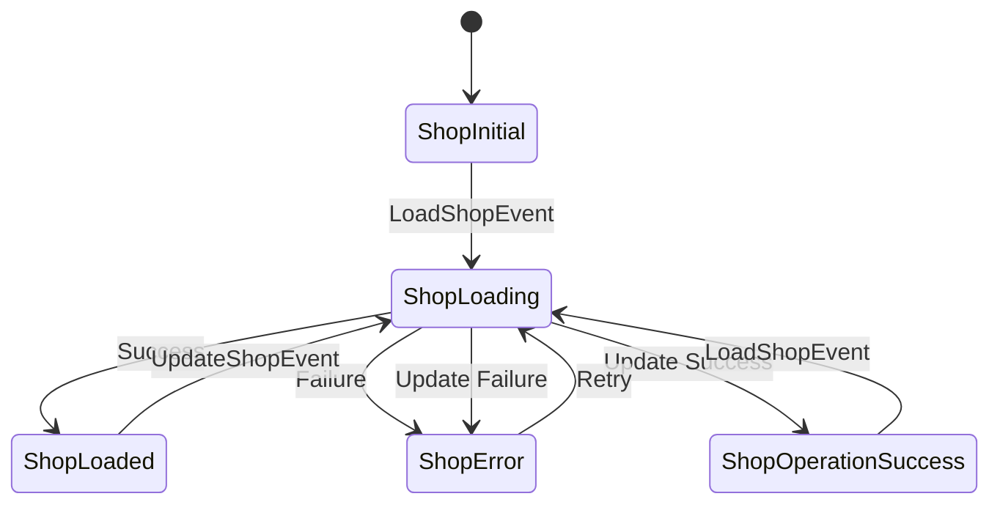

The shop feature manages store information including business details, contact information, and UPI payment configuration. This data is used for receipt printing and payment QR code generation.

## Architecture Overview

The shop feature is simpler than other features as it manages a single entity with read and update operations.

<CardGroup cols={3}>
  <Card title="Domain Layer" icon="circle-nodes">
    Shop entity and repository contract
  </Card>
  <Card title="Data Layer" icon="database">
    Hive-based persistence with ShopModel
  </Card>
  <Card title="Presentation Layer" icon="desktop">
    BLoC for state management
  </Card>
</CardGroup>

## Domain Layer

### Shop Entity

**Location**: `lib/features/shop/domain/entities/shop.dart`

```dart
import 'package:equatable/equatable.dart';

class Shop extends Equatable {
  final String name;
  final String addressLine1;
  final String addressLine2;
  final String phoneNumber;
  final String upiId;
  final String footerText;

  const Shop({
    this.name = '',
    this.addressLine1 = '',
    this.addressLine2 = '',
    this.phoneNumber = '',
    this.upiId = '',
    this.footerText = '',
  });

  Shop copyWith({
    String? name,
    String? addressLine1,
    String? addressLine2,
    String? phoneNumber,
    String? upiId,
    String? footerText,
  }) {
    return Shop(
      name: name ?? this.name,
      addressLine1: addressLine1 ?? this.addressLine1,
      addressLine2: addressLine2 ?? this.addressLine2,
      phoneNumber: phoneNumber ?? this.phoneNumber,
      upiId: upiId ?? this.upiId,
      footerText: footerText ?? this.footerText,
    );
  }

  @override
  List<Object?> get props =>
      [name, addressLine1, addressLine2, phoneNumber, upiId, footerText];
}
```

<Info>
  All shop fields have default empty string values, making the entity always valid even when no data is configured.
</Info>

### Repository Interface

**Location**: `lib/features/shop/domain/repositories/shop_repository.dart`

```dart
import 'package:fpdart/fpdart.dart';
import '../../../../core/error/failure.dart';
import '../../domain/entities/shop.dart';

abstract class ShopRepository {
  Future<Either<Failure, Shop>> getShop();
  Future<Either<Failure, void>> updateShop(Shop shop);
}
```

<Note>
  Unlike the product feature, there's no delete operation since only one shop configuration exists at a time.
</Note>

## Data Layer

### ShopModel

**Location**: `lib/features/shop/data/models/shop_model.dart`

```dart
import 'package:hive/hive.dart';
import '../../domain/entities/shop.dart';

part 'shop_model.g.dart';

@HiveType(typeId: 1)
class ShopModel extends Shop {
  @override
  @HiveField(0)
  final String name;
  
  @override
  @HiveField(1)
  final String addressLine1;
  
  @override
  @HiveField(2)
  final String addressLine2;
  
  @override
  @HiveField(3)
  final String phoneNumber;
  
  @override
  @HiveField(4)
  final String upiId;
  
  @override
  @HiveField(5)
  final String footerText;

  const ShopModel({
    required this.name,
    required this.addressLine1,
    required this.addressLine2,
    required this.phoneNumber,
    required this.upiId,
    required this.footerText,
  }) : super(
          name: name,
          addressLine1: addressLine1,
          addressLine2: addressLine2,
          phoneNumber: phoneNumber,
          upiId: upiId,
          footerText: footerText,
        );

  factory ShopModel.fromEntity(Shop shop) {
    return ShopModel(
      name: shop.name,
      addressLine1: shop.addressLine1,
      addressLine2: shop.addressLine2,
      phoneNumber: shop.phoneNumber,
      upiId: shop.upiId,
      footerText: shop.footerText,
    );
  }

  Shop toEntity() => this;
}
```

<Warning>
  ShopModel uses typeId 1 (ProductModel uses 0). Ensure typeIds are unique across all Hive models.
</Warning>

### Repository Implementation

**Location**: `lib/features/shop/data/repositories/shop_repository_impl.dart`

```dart
import 'package:fpdart/fpdart.dart';
import '../../../../core/data/hive_database.dart';
import '../../../../core/error/failure.dart';
import '../../domain/entities/shop.dart';
import '../../domain/repositories/shop_repository.dart';
import '../models/shop_model.dart';

class ShopRepositoryImpl implements ShopRepository {
  static const String shopKey = 'shop_details';

  @override
  Future<Either<Failure, Shop>> getShop() async {
    try {
      final box = HiveDatabase.shopBox;
      final shop = box.get(shopKey);
      if (shop != null) {
        return Right(shop);
      } else {
        // Return default shop if not found
        return const Right(Shop(
            name: 'Dinesh Shop',
            addressLine1: 'Samrajpet, Mecheri',
            addressLine2: 'Salem - 636453',
            phoneNumber: '+917010674588',
            upiId: 'dineshsowndar@oksbi',
            footerText: 'Thank you, Visit again!!!'));
      }
    } catch (e) {
      return Left(CacheFailure(e.toString()));
    }
  }

  @override
  Future<Either<Failure, void>> updateShop(Shop shop) async {
    try {
      final box = HiveDatabase.shopBox;
      final model = ShopModel.fromEntity(shop);
      await box.put(shopKey, model);
      return const Right(null);
    } catch (e) {
      return Left(CacheFailure(e.toString()));
    }
  }
}
```

<Tip>
  The repository provides default shop values on first load. This ensures the app works out of the box with sample data.
</Tip>

## Presentation Layer

### ShopState

**Location**: `lib/features/shop/presentation/bloc/shop_state.dart`

The shop feature uses discrete state classes instead of a single state with status enum:

```dart
abstract class ShopState extends Equatable {
  const ShopState();
  @override
  List<Object> get props => [];
}

class ShopInitial extends ShopState {}

class ShopLoading extends ShopState {}

class ShopLoaded extends ShopState {
  final Shop shop;
  const ShopLoaded(this.shop);
  @override
  List<Object> get props => [shop];
}

class ShopError extends ShopState {
  final String message;
  const ShopError(this.message);
  @override
  List<Object> get props => [message];
}

class ShopOperationSuccess extends ShopState {}
```

<Note>
  Using discrete state classes provides better type safety and clearer state transitions compared to status enums.
</Note>

### ShopEvent

**Location**: `lib/features/shop/presentation/bloc/shop_event.dart`

<Tabs>
  <Tab title="LoadShopEvent">
    Loads shop details from storage.
    
    ```dart
    class LoadShopEvent extends ShopEvent {}
    ```
  </Tab>
  
  <Tab title="UpdateShopEvent">
    Updates shop configuration.
    
    ```dart
    class UpdateShopEvent extends ShopEvent {
      final Shop shop;
      const UpdateShopEvent(this.shop);
    }
    ```
  </Tab>
</Tabs>

### ShopBloc Implementation

**Location**: `lib/features/shop/presentation/bloc/shop_bloc.dart`

```dart
import 'package:bloc/bloc.dart';
import 'package:equatable/equatable.dart';
import '../../domain/entities/shop.dart';
import '../../domain/usecases/shop_usecases.dart';
import '../../../../core/usecase/usecase.dart';

part 'shop_event.dart';
part 'shop_state.dart';

class ShopBloc extends Bloc<ShopEvent, ShopState> {
  final GetShopUseCase getShopUseCase;
  final UpdateShopUseCase updateShopUseCase;

  ShopBloc({
    required this.getShopUseCase,
    required this.updateShopUseCase,
  }) : super(ShopInitial()) {
    on<LoadShopEvent>(_onLoadShop);
    on<UpdateShopEvent>(_onUpdateShop);
  }

  Future<void> _onLoadShop(LoadShopEvent event, Emitter<ShopState> emit) async {
    emit(ShopLoading());
    final result = await getShopUseCase(NoParams());
    result.fold(
      (failure) => emit(ShopError(failure.message)),
      (shop) => emit(ShopLoaded(shop)),
    );
  }

  Future<void> _onUpdateShop(
      UpdateShopEvent event, Emitter<ShopState> emit) async {
    emit(ShopLoading());
    final result = await updateShopUseCase(event.shop);
    result.fold(
      (failure) => emit(ShopError(failure.message)),
      (_) {
        // Reload shop to update state with latest data
        add(LoadShopEvent());
        emit(ShopOperationSuccess());
      },
    );
  }
}
```

## Usage Examples

### Loading Shop Details

```dart
// Trigger load
context.read<ShopBloc>().add(LoadShopEvent());

// Listen to state
BlocBuilder<ShopBloc, ShopState>(
  builder: (context, state) {
    if (state is ShopLoading) {
      return CircularProgressIndicator();
    }
    if (state is ShopLoaded) {
      return Column(
        children: [
          Text('Shop Name: ${state.shop.name}'),
          Text('Address: ${state.shop.addressLine1}'),
          Text('Phone: ${state.shop.phoneNumber}'),
          Text('UPI: ${state.shop.upiId}'),
        ],
      );
    }
    if (state is ShopError) {
      return Text('Error: ${state.message}');
    }
    return SizedBox.shrink();
  },
)
```

### Updating Shop Information

```dart
final updatedShop = Shop(
  name: 'My Store',
  addressLine1: '123 Main Street',
  addressLine2: 'City, State - 123456',
  phoneNumber: '+919876543210',
  upiId: 'mystore@upi',
  footerText: 'Thank you for shopping!',
);

context.read<ShopBloc>().add(UpdateShopEvent(updatedShop));
```

### Listening for Update Success

```dart
BlocListener<ShopBloc, ShopState>(
  listener: (context, state) {
    if (state is ShopOperationSuccess) {
      ScaffoldMessenger.of(context).showSnackBar(
        SnackBar(content: Text('Shop details updated successfully')),
      );
    }
    if (state is ShopError) {
      ScaffoldMessenger.of(context).showSnackBar(
        SnackBar(
          content: Text('Error: ${state.message}'),
          backgroundColor: Colors.red,
        ),
      );
    }
  },
  child: YourWidget(),
)
```

## Integration with Other Features

### Receipt Printing

The billing feature uses shop details for receipt headers:

```dart
// In billing checkout page
BlocBuilder<ShopBloc, ShopState>(
  builder: (context, shopState) {
    if (shopState is ShopLoaded) {
      return ElevatedButton(
        onPressed: () {
          context.read<BillingBloc>().add(
            PrintReceiptEvent(
              shopName: shopState.shop.name,
              address1: shopState.shop.addressLine1,
              address2: shopState.shop.addressLine2,
              phone: shopState.shop.phoneNumber,
              footer: shopState.shop.footerText,
            ),
          );
        },
        child: Text('Print Receipt'),
      );
    }
    return SizedBox.shrink();
  },
)
```

### UPI Payment QR Code

The checkout page generates UPI QR codes using shop data:

```dart
if (shopState is ShopLoaded && shopState.shop.upiId.isNotEmpty) {
  PrettyQrView.data(
    data: 'upi://pay?pa=${shopState.shop.upiId}'
          '&pn=${shopState.shop.name}'
          '&am=${totalAmount.toStringAsFixed(2)}'
          '&cu=INR',
  );
}
```

<Info>
  The UPI QR code follows the standard UPI deep link format for payment apps like Google Pay, PhonePe, and Paytm.
</Info>

## State Flow



## Field Descriptions

<ParamField path="name" type="string">
  The business name displayed on receipts and QR codes
</ParamField>

<ParamField path="addressLine1" type="string">
  First line of the business address (street/area)
</ParamField>

<ParamField path="addressLine2" type="string">
  Second line of address (city, state, postal code)
</ParamField>

<ParamField path="phoneNumber" type="string">
  Contact phone number with country code (e.g., +919876543210)
</ParamField>

<ParamField path="upiId" type="string">
  UPI payment ID for QR code generation (e.g., merchant@upi)
</ParamField>

<ParamField path="footerText" type="string">
  Custom message printed at the bottom of receipts
</ParamField>

## Related Features

<CardGroup cols={2}>
  <Card title="Billing Feature" icon="shopping-cart" href="./billing-feature">
    Uses shop details for receipts and payments
  </Card>
  <Card title="Settings Feature" icon="gear" href="./settings-feature">
    Configure shop details in settings UI
  </Card>
</CardGroup>