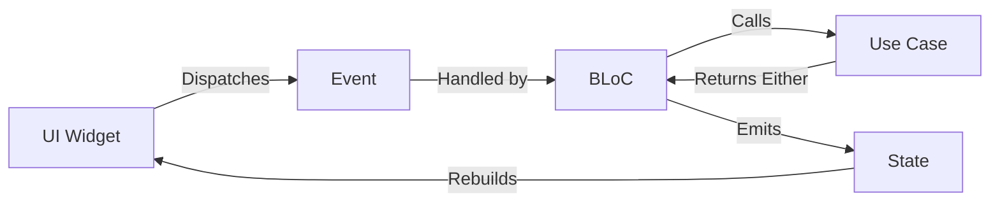

## Overview

The Flutter Billing App uses the **BLoC (Business Logic Component)** pattern via the `flutter_bloc` package for state management. BLoC provides a clear separation between business logic and UI, making the app predictable, testable, and scalable.

<Info>
BLoC stands for **Business Logic Component**. It processes events from the UI and emits states back to the UI, creating a unidirectional data flow.
</Info>

## BLoC Architecture Flow



<Steps>
  <Step title="User Interaction">
    User interacts with UI (button press, form submission)
  </Step>
  <Step title="Event Dispatched">
    Widget dispatches an event to the BLoC
  </Step>
  <Step title="BLoC Processing">
    BLoC receives event and calls appropriate use case
  </Step>
  <Step title="State Emission">
    BLoC emits new state based on use case result
  </Step>
  <Step title="UI Update">
    Widget rebuilds with new state
  </Step>
</Steps>

## BLoC Components

Every BLoC consists of three parts:

<CardGroup cols={3}>
  <Card title="Events" icon="bolt" color="#f59e0b">
    **User Actions**
    
    Represent user intentions or system events that trigger state changes.
  </Card>
  
  <Card title="States" icon="layer-group" color="#3b82f6">
    **UI State**
    
    Immutable snapshots of the UI's current condition.
  </Card>
  
  <Card title="BLoC" icon="gears" color="#10b981">
    **Business Logic**
    
    Processes events and emits states by coordinating use cases.
  </Card>
</CardGroup>

## Product BLoC Example

Let's examine the complete Product feature BLoC implementation:

### Events

Events are immutable and use `Equatable` for value comparison:

```dart lib/features/product/presentation/bloc/product_event.dart
part of 'product_bloc.dart';

abstract class ProductEvent extends Equatable {
  const ProductEvent();

  @override
  List<Object> get props => [];
}

class LoadProducts extends ProductEvent {}

class AddProduct extends ProductEvent {
  final Product product;
  const AddProduct(this.product);
  
  @override
  List<Object> get props => [product];
}

class UpdateProduct extends ProductEvent {
  final Product product;
  const UpdateProduct(this.product);
  
  @override
  List<Object> get props => [product];
}

class DeleteProduct extends ProductEvent {
  final String id;
  const DeleteProduct(this.id);
  
  @override
  List<Object> get props => [id];
}
```

<Accordion title="Why use Equatable for events?">
`Equatable` enables value-based equality comparison. Two events with the same data are considered equal, preventing unnecessary BLoC executions and improving performance.

```dart
// Without Equatable: always false (different instances)
LoadProducts() == LoadProducts() // false

// With Equatable: true (same values)
LoadProducts() == LoadProducts() // true
```
</Accordion>

### States

States represent different UI conditions with enum-based status:

```dart lib/features/product/presentation/bloc/product_state.dart
part of 'product_bloc.dart';

enum ProductStatus { initial, loading, loaded, error, success }

class ProductState extends Equatable {
  final ProductStatus status;
  final List<Product> products;
  final String? message;

  const ProductState({
    this.status = ProductStatus.initial,
    this.products = const [],
    this.message,
  });

  ProductState copyWith({
    ProductStatus? status,
    List<Product>? products,
    String? message,
  }) {
    return ProductState(
      status: status ?? this.status,
      products: products ?? this.products,
      message: message,
    );
  }

  @override
  List<Object?> get props => [status, products, message];
}
```

<Tabs>
  <Tab title="State Properties">
    | Property | Type | Purpose |
    |----------|------|----------|
    | `status` | `ProductStatus` | Current operation state (loading, loaded, error) |
    | `products` | `List<Product>` | Current list of products |
    | `message` | `String?` | Success/error messages for user feedback |
  </Tab>
  <Tab title="Status Enum">
    | Status | Meaning |
    |--------|----------|
    | `initial` | No data loaded yet |
    | `loading` | Operation in progress |
    | `loaded` | Data successfully loaded |
    | `error` | Operation failed |
    | `success` | Transient success state (add/update/delete) |
  </Tab>
</Tabs>

### BLoC Implementation

The BLoC coordinates use cases and manages state transitions:

```dart lib/features/product/presentation/bloc/product_bloc.dart
import 'package:bloc/bloc.dart';
import 'package:equatable/equatable.dart';
import '../../domain/entities/product.dart';
import '../../domain/usecases/product_usecases.dart';
import '../../../../core/usecase/usecase.dart';

part 'product_event.dart';
part 'product_state.dart';

class ProductBloc extends Bloc<ProductEvent, ProductState> {
  final GetProductsUseCase getProductsUseCase;
  final AddProductUseCase addProductUseCase;
  final UpdateProductUseCase updateProductUseCase;
  final DeleteProductUseCase deleteProductUseCase;

  ProductBloc({
    required this.getProductsUseCase,
    required this.addProductUseCase,
    required this.updateProductUseCase,
    required this.deleteProductUseCase,
  }) : super(const ProductState()) {
    on<LoadProducts>(_onLoadProducts);
    on<AddProduct>(_onAddProduct);
    on<UpdateProduct>(_onUpdateProduct);
    on<DeleteProduct>(_onDeleteProduct);
  }

  Future<void> _onLoadProducts(
      LoadProducts event, Emitter<ProductState> emit) async {
    emit(state.copyWith(status: ProductStatus.loading));
    final result = await getProductsUseCase(NoParams());
    result.fold(
      (failure) => emit(state.copyWith(
          status: ProductStatus.error, message: failure.message)),
      (products) => emit(
          state.copyWith(status: ProductStatus.loaded, products: products)),
    );
  }

  Future<void> _onAddProduct(
      AddProduct event, Emitter<ProductState> emit) async {
    emit(state.copyWith(status: ProductStatus.loading));
    final result = await addProductUseCase(event.product);
    result.fold(
      (failure) => emit(state.copyWith(
          status: ProductStatus.error, message: failure.message)),
      (_) {
        emit(state.copyWith(
            status: ProductStatus.success,
            message: 'Product added successfully'));
        add(LoadProducts());
      },
    );
  }

  Future<void> _onUpdateProduct(
      UpdateProduct event, Emitter<ProductState> emit) async {
    emit(state.copyWith(status: ProductStatus.loading));
    final result = await updateProductUseCase(event.product);
    result.fold(
      (failure) => emit(state.copyWith(
          status: ProductStatus.error, message: failure.message)),
      (_) {
        emit(state.copyWith(
            status: ProductStatus.success,
            message: 'Product updated successfully'));
        add(LoadProducts());
      },
    );
  }

  Future<void> _onDeleteProduct(
      DeleteProduct event, Emitter<ProductState> emit) async {
    emit(state.copyWith(status: ProductStatus.loading));
    final result = await deleteProductUseCase(event.id);
    result.fold(
      (failure) => emit(state.copyWith(
          status: ProductStatus.error, message: failure.message)),
      (_) {
        emit(state.copyWith(
            status: ProductStatus.success,
            message: 'Product deleted successfully'));
        add(LoadProducts());
      },
    );
  }
}
```

<Note>
Notice how each event handler follows the same pattern:
1. Emit loading state
2. Call use case
3. Use `.fold()` to handle Either result
4. Emit success or error state
5. Reload data if needed
</Note>

## Billing BLoC Example

The Billing BLoC manages the shopping cart and checkout process:

```dart lib/features/billing/presentation/bloc/billing_bloc.dart (excerpt)
class BillingBloc extends Bloc<BillingEvent, BillingState> {
  final GetProductByBarcodeUseCase getProductByBarcodeUseCase;

  BillingBloc({required this.getProductByBarcodeUseCase})
      : super(const BillingState()) {
    on<ScanBarcodeEvent>(_onScanBarcode);
    on<AddProductToCartEvent>(_onAddProductToCart);
    on<RemoveProductFromCartEvent>(_onRemoveProductFromCart);
    on<UpdateQuantityEvent>(_onUpdateQuantity);
    on<ClearCartEvent>(_onClearCart);
    on<PrintReceiptEvent>(_onPrintReceipt);
  }

  Future<void> _onScanBarcode(
      ScanBarcodeEvent event, Emitter<BillingState> emit) async {
    final result = await getProductByBarcodeUseCase(event.barcode);
    result.fold(
      (failure) =>
          emit(state.copyWith(error: 'Product not found: ${event.barcode}')),
      (product) {
        add(AddProductToCartEvent(product));
      },
    );
  }

  void _onAddProductToCart(
      AddProductToCartEvent event, Emitter<BillingState> emit) {
    final existingIndex = state.cartItems
        .indexWhere((item) => item.product.id == event.product.id);
    if (existingIndex >= 0) {
      final existingItem = state.cartItems[existingIndex];
      final updatedItems = List<CartItem>.from(state.cartItems);
      updatedItems[existingIndex] =
          existingItem.copyWith(quantity: existingItem.quantity + 1);
      emit(state.copyWith(cartItems: updatedItems));
    } else {
      final newItem = CartItem(product: event.product);
      emit(state.copyWith(cartItems: [...state.cartItems, newItem]));
    }
  }
}
```

<Accordion title="Event chaining pattern">
Notice `_onScanBarcode` dispatches another event (`AddProductToCartEvent`) instead of directly modifying state. This keeps event handlers focused on a single responsibility.

```dart
// Good: Event chaining
add(AddProductToCartEvent(product));

// Avoid: Duplicating logic
emit(state.copyWith(cartItems: [...]));
```
</Accordion>

## Using BLoC in UI

### Providing BLoC

BLoCs are provided at the app level using `MultiBlocProvider`:

```dart lib/main.dart (excerpt)
MultiBlocProvider(
  providers: [
    BlocProvider<ProductBloc>(
      create: (context) => di.sl<ProductBloc>()..add(LoadProducts())),
    BlocProvider<BillingBloc>(
      create: (context) => BillingBloc(getProductByBarcodeUseCase: di.sl())),
  ],
  child: MaterialApp.router(...),
)
```

<Note>
`di.sl<ProductBloc>()` retrieves the BLoC from the service locator (get_it). See [Dependency Injection](/development/dependency-injection) for details.
</Note>

### Dispatching Events

Dispatch events using `context.read<BLoC>()`:

```dart
// Add product button
ElevatedButton(
  onPressed: () {
    context.read<ProductBloc>().add(AddProduct(newProduct));
  },
  child: Text('Add Product'),
)

// Delete product
IconButton(
  icon: Icon(Icons.delete),
  onPressed: () {
    context.read<ProductBloc>().add(DeleteProduct(product.id));
  },
)
```

### Listening to State

Use `BlocBuilder` to rebuild UI when state changes:

```dart
BlocBuilder<ProductBloc, ProductState>(
  builder: (context, state) {
    switch (state.status) {
      case ProductStatus.loading:
        return Center(child: CircularProgressIndicator());
      case ProductStatus.error:
        return Text('Error: ${state.message}');
      case ProductStatus.loaded:
        return ListView.builder(
          itemCount: state.products.length,
          itemBuilder: (context, index) {
            final product = state.products[index];
            return ListTile(
              title: Text(product.name),
              subtitle: Text('\$${product.price}'),
            );
          },
        );
      default:
        return SizedBox();
    }
  },
)
```

### BlocListener for Side Effects

Use `BlocListener` for non-UI side effects (navigation, snackbars):

```dart
BlocListener<ProductBloc, ProductState>(
  listener: (context, state) {
    if (state.status == ProductStatus.success) {
      ScaffoldMessenger.of(context).showSnackBar(
        SnackBar(content: Text(state.message ?? 'Success')),
      );
    } else if (state.status == ProductStatus.error) {
      ScaffoldMessenger.of(context).showSnackBar(
        SnackBar(
          content: Text(state.message ?? 'Error'),
          backgroundColor: Colors.red,
        ),
      );
    }
  },
  child: ProductListView(),
)
```

### BlocConsumer (Builder + Listener)

Combine both for complex scenarios:

```dart
BlocConsumer<ProductBloc, ProductState>(
  listener: (context, state) {
    // Handle side effects
    if (state.status == ProductStatus.success) {
      Navigator.pop(context);
    }
  },
  builder: (context, state) {
    // Build UI
    return ProductForm(isLoading: state.status == ProductStatus.loading);
  },
)
```

## BLoC Best Practices

<AccordionGroup>
  <Accordion title="Keep BLoC logic pure">
    BLoCs should only coordinate use cases, not contain business logic. Business rules belong in the domain layer (use cases).
    
    ```dart
    // Good: BLoC delegates to use case
    final result = await addProductUseCase(product);
    
    // Bad: Business logic in BLoC
    if (product.price > 1000) {
      // validation logic
    }
    ```
  </Accordion>
  
  <Accordion title="Always use copyWith for states">
    Never mutate state directly. Always create new state instances using `copyWith`.
    
    ```dart
    // Good: Immutable state
    emit(state.copyWith(status: ProductStatus.loading));
    
    // Bad: Mutation (won't work with Equatable)
    state.status = ProductStatus.loading;
    ```
  </Accordion>
  
  <Accordion title="Use Equatable for all events and states">
    Equatable prevents unnecessary rebuilds by enabling value comparison.
    
    ```dart
    class ProductState extends Equatable {
      @override
      List<Object?> get props => [status, products, message];
    }
    ```
  </Accordion>
  
  <Accordion title="Handle loading, success, and error states">
    Always provide feedback for all operation states.
    
    ```dart
    emit(state.copyWith(status: ProductStatus.loading));
    result.fold(
      (failure) => emit(state.copyWith(status: ProductStatus.error)),
      (data) => emit(state.copyWith(status: ProductStatus.success)),
    );
    ```
  </Accordion>
  
  <Accordion title="Close BLoCs properly">
    BLoCs are automatically closed by `BlocProvider`, but if you manually create them, always call `close()`.
    
    ```dart
    @override
    void dispose() {
      myBloc.close();
      super.dispose();
    }
    ```
  </Accordion>
</AccordionGroup>

## Testing BLoCs

BLoCs are highly testable using `bloc_test`:

```dart
import 'package:bloc_test/bloc_test.dart';
import 'package:mockito/mockito.dart';

void main() {
  late ProductBloc productBloc;
  late MockGetProductsUseCase mockGetProductsUseCase;

  setUp(() {
    mockGetProductsUseCase = MockGetProductsUseCase();
    productBloc = ProductBloc(
      getProductsUseCase: mockGetProductsUseCase,
      // ... other use cases
    );
  });

  blocTest<ProductBloc, ProductState>(
    'emits [loading, loaded] when LoadProducts succeeds',
    build: () {
      when(mockGetProductsUseCase(any))
          .thenAnswer((_) async => Right([testProduct]));
      return productBloc;
    },
    act: (bloc) => bloc.add(LoadProducts()),
    expect: () => [
      ProductState(status: ProductStatus.loading),
      ProductState(status: ProductStatus.loaded, products: [testProduct]),
    ],
  );
}
```

## State Management Comparison

<Tabs>
  <Tab title="BLoC vs Provider">
    | Feature | BLoC | Provider |
    |---------|------|----------|
    | Learning curve | Steep | Gentle |
    | Boilerplate | More | Less |
    | Testability | Excellent | Good |
    | Separation of concerns | Strong | Moderate |
    | Async handling | Built-in | Manual |
  </Tab>
  <Tab title="BLoC vs Riverpod">
    | Feature | BLoC | Riverpod |
    |---------|------|----------|
    | State management | Events → States | Providers |
    | Testability | Excellent | Excellent |
    | Compile-time safety | Good | Better |
    | Code generation | No | Optional |
    | Ecosystem | Mature | Growing |
  </Tab>
</Tabs>

<Info>
This app uses BLoC because it enforces strict separation of concerns, provides excellent testing support, and scales well for complex state management scenarios.
</Info>

## Next Steps

<CardGroup cols={2}>
  <Card title="Clean Architecture" icon="layer-group" href="/development/clean-architecture">
    Understand how BLoC fits into the overall architecture
  </Card>
  <Card title="Dependency Injection" icon="plug" href="/development/dependency-injection">
    Learn how BLoCs are registered and provided
  </Card>
  <Card title="Project Structure" icon="folder-tree" href="/development/project-structure">
    See where BLoC files are organized
  </Card>
</CardGroup>